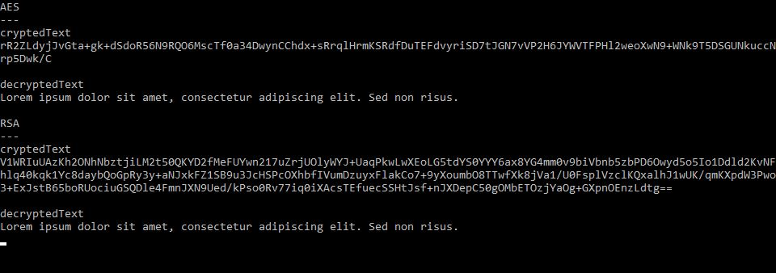

# pwCryptoLibrary
A C# library to encrypt and decrypt data with AES, RSA, TripleDES algorithms.  

**How to use :**

```c#
string textToEncrypt = "Lorem ipsum dolor sit amet, consectetur adipiscing elit. Sed non risus.";
string passPhrase = "your passphrase";
string cryptedText;
string decryptedText;
string RSAPublicKey = "";
string RSAPrivateKey = "";

Console.WriteLine("AES");
Console.WriteLine("---");
cryptedText = CryptoService.Encrypt(CryptoService.CryptoServiceEnum.AES, passPhrase, textToEncrypt);
Console.WriteLine(cryptedText);
decryptedText = CryptoService.Decrypt(CryptoService.CryptoServiceEnum.AES, passPhrase, cryptedText);
Console.WriteLine(decryptedText);

Console.WriteLine();

Console.WriteLine("RSA");
Console.WriteLine("---");
CryptoService.RSAGenerateKeys(2048, ref RSAPublicKey, ref RSAPrivateKey);
cryptedText = CryptoService.Encrypt(CryptoService.CryptoServiceEnum.RSA, "", textToEncrypt, RSAPublicKey);
Console.WriteLine(cryptedText);
decryptedText = CryptoService.Decrypt(CryptoService.CryptoServiceEnum.RSA, "", cryptedText, RSAPrivateKey);
Console.WriteLine(decryptedText);
```

Result :




**Important note :**

For RSA, the passphrase is not needed.  
You must generate public and private key before using the method
```c#
CryptoService.RSAGenerateKeys
```
Then, you must send public key to encrypt and private key to decrypt.

